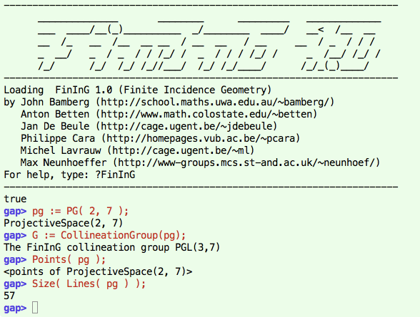

# Software

One of my side projects is to develop packages for the computer algebra software [GAP](http://www.gap-system.org).

## Forms

is a package, developed by me and [Jan De Beule](http://cage.ugent.be/~jdebeule/). It can be used for work with sesquilinear and quadratic forms, objects that are used to describe polar spaces and classical groups. The package also deals with the recognition of certain matrix groups preserving a sesquilinear or quadratic form. The main features of forms are its facility with creating sesquilinear and quadratic forms via matrices and polynomials, and in changing forms (creation of isometries).

[GAP webpage for 'Forms'](http://gap-system.org/Packages/forms.html)  
[Primary webpage for 'Forms'](http://cage.ugent.be/geometry/forms.php)

## FinInG

is a package that provides users with the basic tools to work in various areas of finite incidence geometry, from the realms of projective spaces to the flat lands of generalised polygons. It uses the algebraic power of GAP, particularly its implementation of matrix and permutation groups. If you would like to try the package, don't hesitate to contact me, or any other member of the development team. 

     

[Webpage for 'FinInG'](http://fining.org)

## AssociationSchemes

is a package for simple generic use of association schemes and homogeneous coherent configurations.

[Webpage for 'AssociationSchemes'](http://www.jesselansdown.com/AssociationSchemes/)
